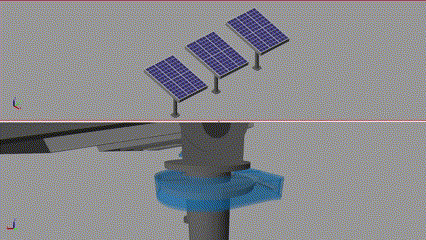
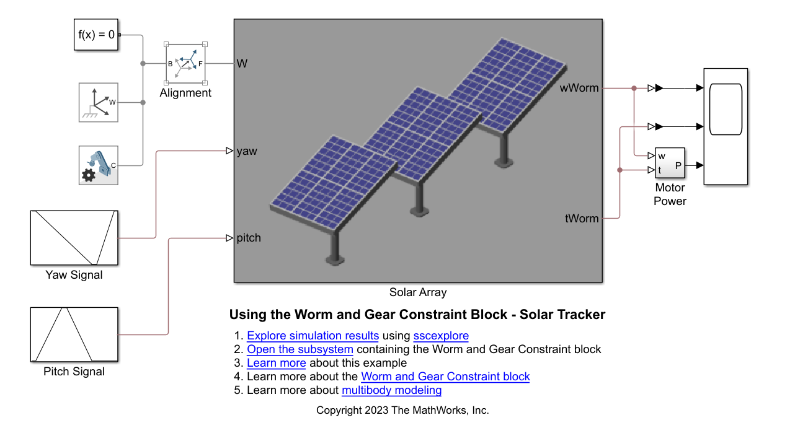
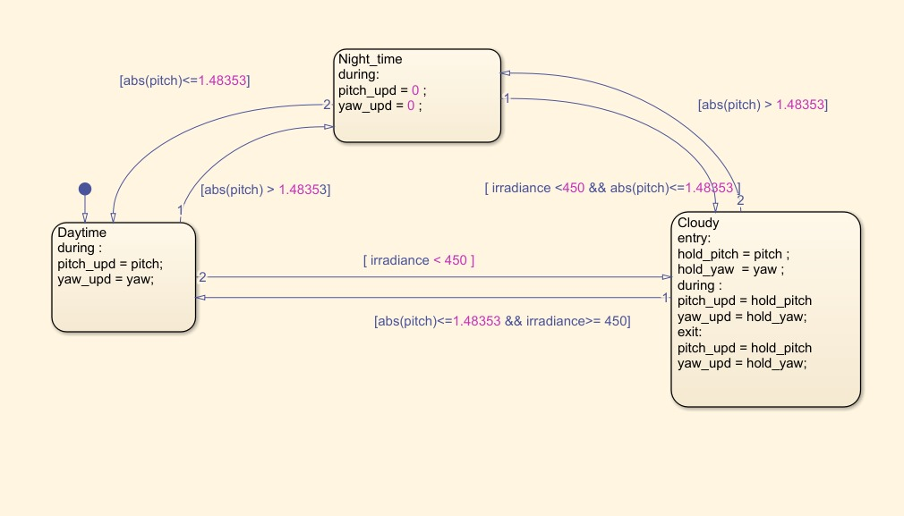
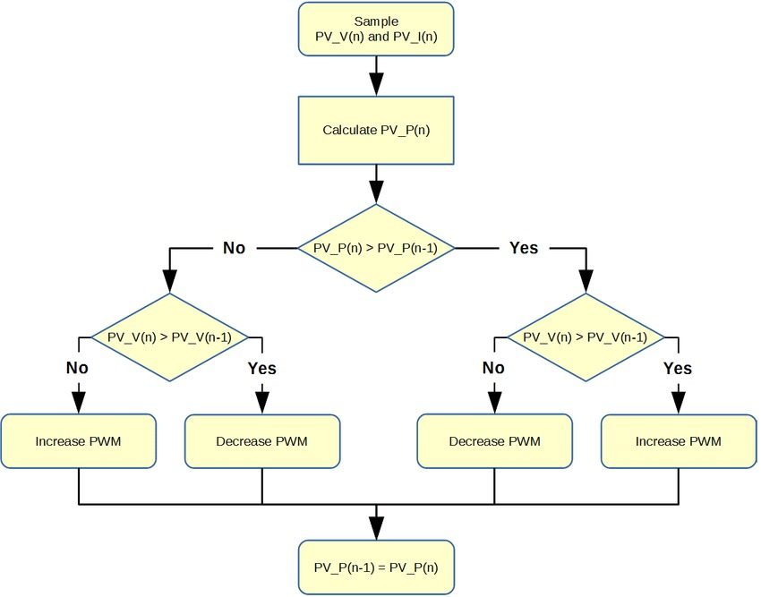
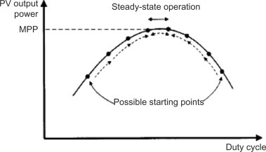
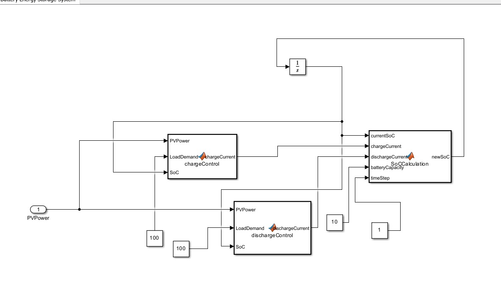
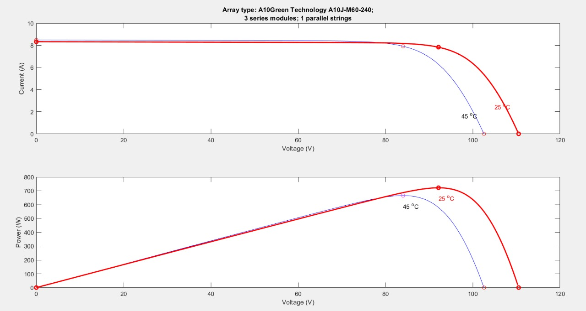

# 🌞 Solar-Tracker-Control-Simulation 🌍

  

---

## 🚀 Project Overview
This is a design and implementation of a controller to control the axis of a solar tracker system to optimize the angle of incidence between solar panels and sunlight for maximum energy absorption. The foundational element for this project is the ***"Using the Worm and Gear Constraint Block - Solar Tracker"*** example from ***Simscape™ Multibody™***. It is a simulation-based control system that manages the movement of at least one mechanical axis of a solar panel system to accurately track the sun's path across the sky. The decision on which axis to prioritize and implement first in a solar tracking system is based on maximizing solar energy capture, which is influenced by the path of the sun relative to the location of the solar panels. For example, the sun's elevation in equatorial regions does not vary as much throughout the year, so a ***single-axis azimuth tracker*** might be sufficient. Conversely, in higher latitudes, the elevation axis might be more critical due to the significant variation in the sun's altitude with the seasons. Therefore, the design of the solar tracking system is tailored to the installation's specific geographic location and the solar panels' orientation. Here's a brief overview of the typical functions of each axis in a solar tracking system:
### 🌍 Geographic Influence on Solar Tracking
- ***Azimuth Axis***: This axis allows the solar tracker to rotate horizontally. The movement along this axis aligns the solar panels with the sun's position from east to west throughout the day. Control of the azimuth axis is essential for following the sun's apparent motion across the sky, which is primarily due to the Earth's rotation.
- ***Elevation (Altitude) Axis***: The elevation axis enables vertical movement of the solar panels. Adjustments along this axis change the tilt of the panels to match the sun's elevation in the sky, which varies with the time of day and seasons.

## Project Implementation

We used the solar tracker model of "Using the Worm and Gear Constraint Block - Solar Tracker" example from Simscape™ Multibody™. The model takes latitude, longitude, and the current time as its input and updates the position of the solar panel.

#### 🛠 Worm and Gear Constraint Block

  

### 🎛 Control System Design:

To effectively manage the solar tracker, integrating control systems such as ***PID controllers*** is crucial. These controllers adjust the yaw and pitch angles of the solar panels to ensure they are always optimally oriented toward the sun. The PID controllers take the difference between the desired and actual angles and adjust the motor voltage accordingly to minimize this difference, thereby optimizing the solar panel's orientation and maximizing energy capture.

### 📐 MATLAB Functions for Solar Position Calculation:

A MATLAB function calculates the yaw and pitch angles required for the solar tracker. This function utilizes the Solar Position Algorithm (SPA) to compute the ***solar azimuth and zenith angles*** based on ***geographic location*** and ***time***. The calculated angles are then used as inputs to the PID controllers, ensuring that the solar panels accurately align with the sun's position throughout the day.

### ☀️ Solar Irradiance Data  

In this project, solar irradiance data was collected from the NASA website using their API, providing a comprehensive dataset for 30 diverse locations across the globe. The data spans an entire year, from January 1, 2022, to December 31, 2022, with hourly measurements for each location. This detailed dataset was carefully preprocessed to ensure accuracy and consistency, which is crucial for training robust models.

After preprocessing, the Neural Net Fitting App in MATLAB was employed to develop an artificial neural network (ANN). This ANN was designed to predict solar irradiance based on key input parameters: latitude, longitude, month, day, and hour. By training on the gathered data, the ANN was able to learn the complex relationships between these inputs and solar irradiance, capturing both temporal and spatial variations.

The trained neural network serves as a predictive model, enabling the estimation of solar irradiance at any given location and time. This capability is vital for optimizing solar energy systems, as it helps forecast energy production and improve solar panels' efficiency. The neural net showcases the integration of data acquisition, preprocessing, and advanced machine learning techniques to solve a real-world problem in renewable energy. The comprehensive approach ensures that the model is both accurate and generalizable, making it a valuable tool for researchers and practitioners in the field of solar energy.

### 🧠 Stateflow Algorithm for Energy Optimization

A Stateflow chart is implemented to manage the solar tracker’s operational modes: Daytime Mode, Night-time Mode, and Cloudy Mode. In ***Daytime Mode***, the system continuously adjusts to follow the sun. In ***Night-time Mode***, the tracker moves to a default position to minimize wear and tear. During ***Cloudy Mode***, the tracker holds its current position to save energy, as precise tracking is less critical. These modes are controlled by state transitions based on real-time inputs such as sunlight intensity and time of day, ensuring the system adapts dynamically to varying conditions.

  

### ⚡ Maximum Power Point Tracking (MPPT) Algorithm

An MPPT algorithm is integrated into the system to optimize the energy output of the solar panels. The ***MPPT algorithm*** continuously adjusts the electrical operating point of the modules to ensure they operate at their maximum power point. This is crucial for extracting the maximum possible energy from the solar panels under varying environmental conditions, thereby enhancing the overall efficiency of the solar tracker system. We use the P&O technique of the MPPT algorithm. 

The Perturb and Observe method has a simple feedback structure and few measured parameters. It operates by periodically perturbing (i.e. incrementing or decrementing) the duty cycle controlling the array current  and comparing the PV output power with that of the previous perturbation cycle. If the perturbation leads to an increase (or decrease) in array power, the subsequent perturbation is made in the same (or opposite) direction. In this manner, the peak power tracker continuously seeks the peak power condition.

  
  

### 🔋 Battery Energy Storage System (BESS)
This system is designed to integrate a solar PV system with a ***battery energy storage system (BESS)*** to optimize energy usage and improve system resilience. The main components of the system include a photovoltaic (PV) array, a battery, and control algorithms for charging and discharging the battery based on the PV power generation, load demand, and the state of charge (SoC) of the battery.

  

## Voltage Variation with Current and Power ##

  

---

## 📋 Procedure

1. Fork or download the entire Solar-Tracker-Control-Simulation repository.
2. Open the `WormAndGearConstraint` Simulink model.
3. Input the latitude and longitude of the solar tracker’s location.
4. Adjust the motor parameters and solar panel settings as needed.
5. Re-tune the PID controller if motor parameters are changed.
6. Run the simulation.

---

 
## 👥 Contributors
- Kshitij Amarnath Shetty, Mechanical Engineering Dept., IIT Indore
- Kaustuv Devmishra, Mechanical Engineering Dept., IIT Indore
- Krishan Swami, Mechanical Engineering Dept., IIT Indore
- Mihir Hemani, Mechanical Engineering Dept., IIT Indore

  
